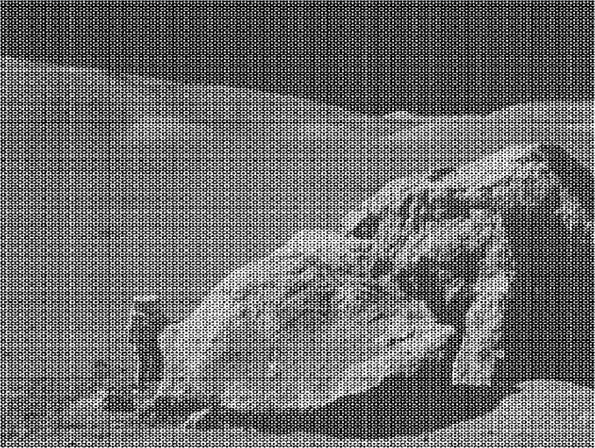
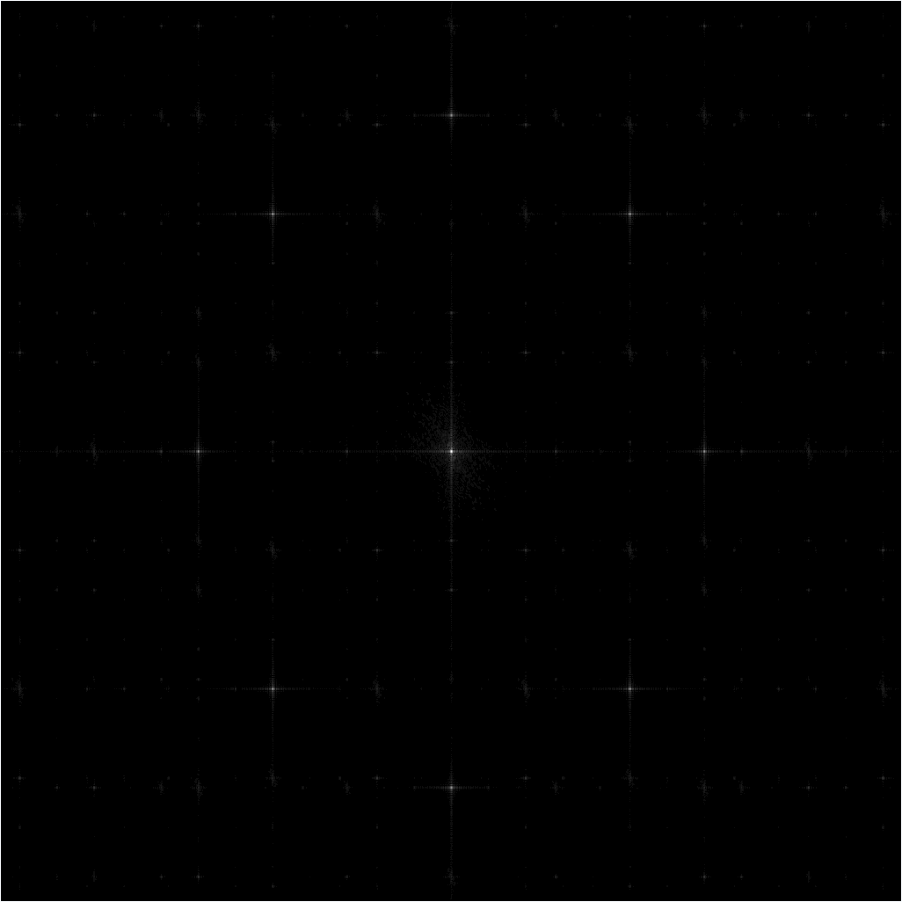
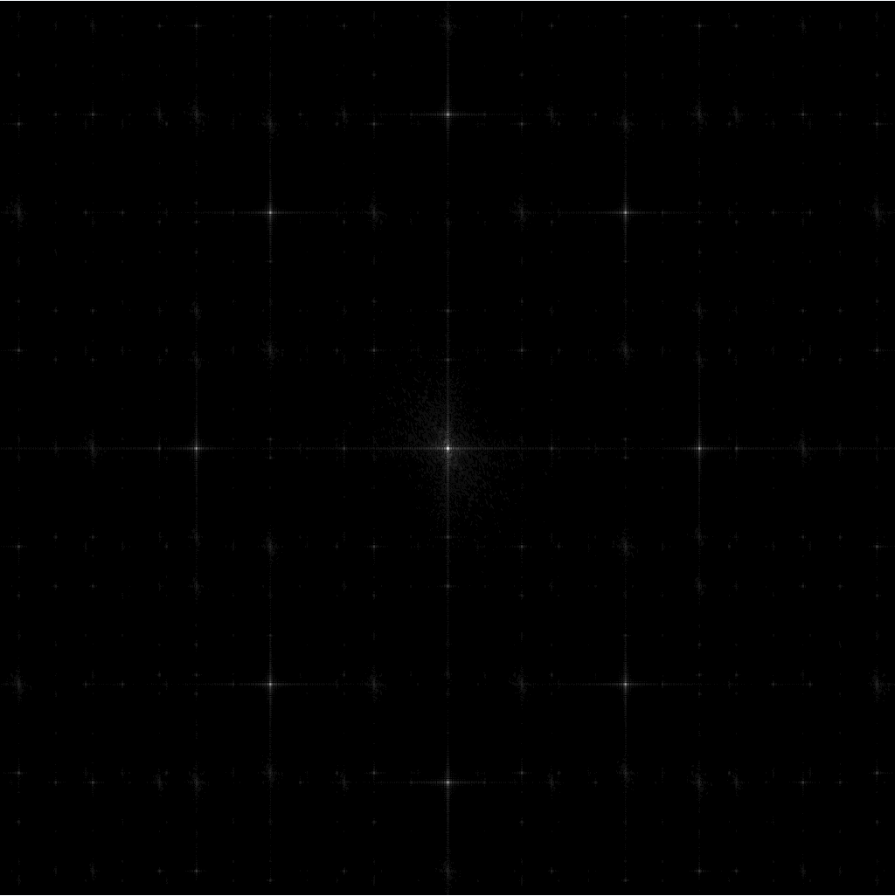
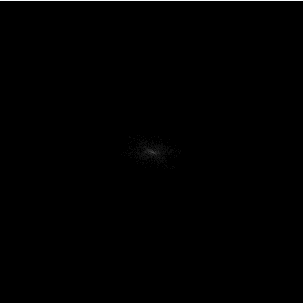
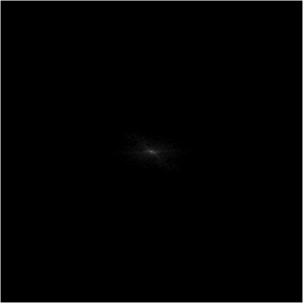
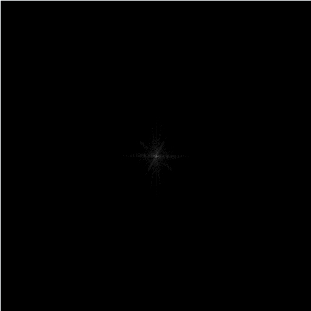
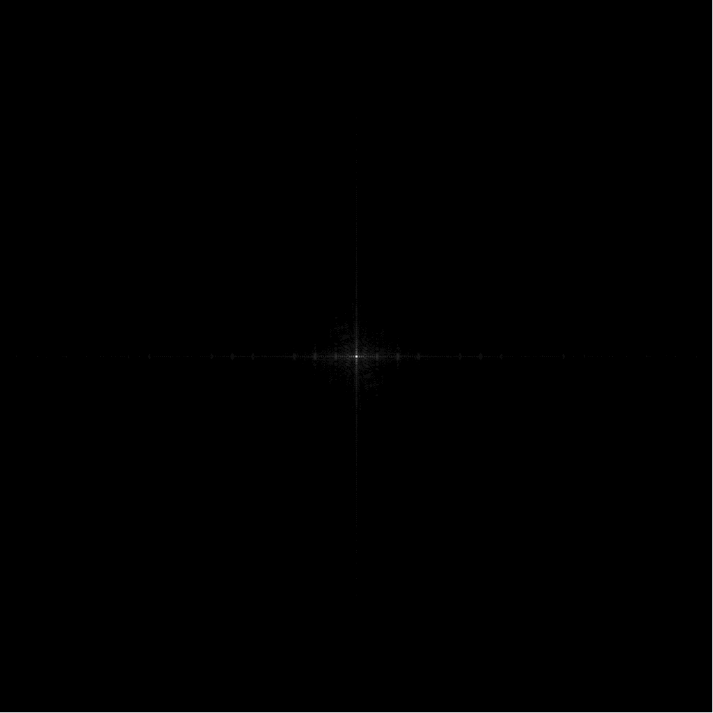
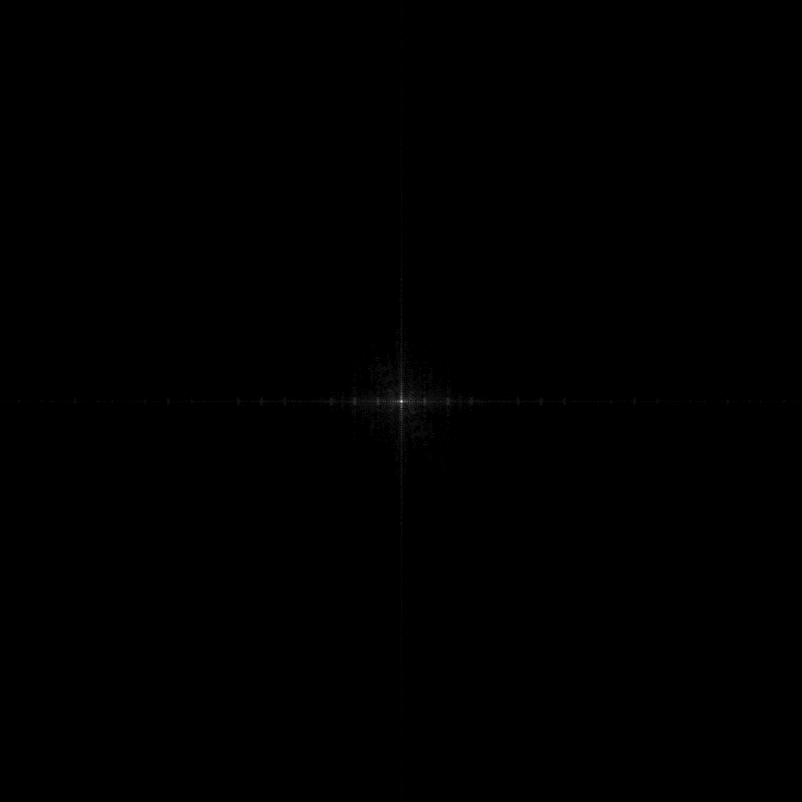

# Assignment2

 张弛 202028013626005

## 问题1，2，3（文件夹`question3`）

实现`dft2D()`函数：对读入的图像数组数据转为`complex`格式。在`dft2D()`函数中顺带实现补0功能，首先判断读入数组的长宽是否为2的整数次幂，如果不是，取长和宽中的最大值，`log2`一下取整加一再幂方，得到扩展后的长和宽大小。以此为长宽初始化一个新的全0数组（格式为`complex`），再将原图像数组传入。然后从行开始使用库中的`np.fft.fft`函数对每一行进行傅里叶变换，对结果再同样对每一列在进行变换，得到二维傅里叶变换的结果。

实现`idft2D()`函数：对传入的函数如正向变换一样使用库中的`np.fft.ifft`函数进行逆变换。

对于问题3：首先实现灰度归一化函数`normalize()`。传入灰度图矩阵`gray`，使用库函数`np.amin()`和`np.amax()`函数找二维矩阵中的最大最小值，然后对其中的每一点的数据作如下变换：$temp[i][j] = (gray[i][j] - min) / (max - min)$从而实现归一化。对图像进行归一化和变换后的结果如下：

|                             原图                             |                         归一化的图像                         |                     执行两次变换后的图像                     |                     差值图像                      |
| :----------------------------------------------------------: | :----------------------------------------------------------: | :----------------------------------------------------------: | :-----------------------------------------------: |
|  |  |  |  |

图中差值图像为f与g每个点灰度值作差的绝对值分布，可见差值都处在$10^{-16}$量级，几乎忽略不计

## 问题4（文件夹`question4`）

首先按要求过作图，白色处值为1，格式为`float`，不用归一化。调用`dft2D`函数对其进行二维傅里叶变换。将得到的结果用`np.abs`作模方得到功率谱，再使用`normalize()`进行归一化即可输出初始的谱图。

再对该结果进行中心化：定义一个`center_shift()`函数，将输入矩阵分割为四大块，对角块互换，即可完成中心化。

再对中心化的结果取对数变换，再归一化进行输出。

|                             原图                             |      二维傅里叶变换       |                 中心化                  |                            取对数                            |
| :----------------------------------------------------------: | :-----------------------: | :-------------------------------------: | :----------------------------------------------------------: |
|  |  |  |  |

## 选做

各图像及代码在相应文件夹下：

|                             原图                             |                        二维中心化变换                        |                          取对数结果                          |
| :----------------------------------------------------------: | :----------------------------------------------------------: | :----------------------------------------------------------: |
|  |  |  |
|  |  |  |
|  |  |  |
|  |  |  |
|  |  |  |

